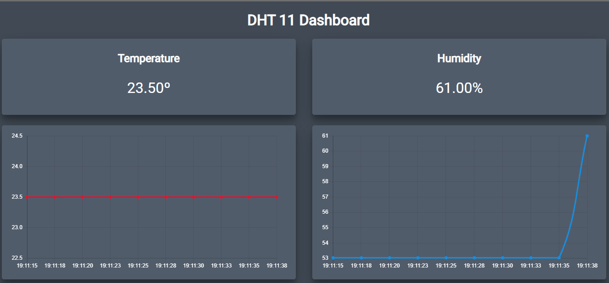

# APP-WEB---DHT11
MEAN app using the data colected from a DHT11 sensor and D1 mini WiFi card
# Requirements
* DHT11 Temperature/Humidity sensor
* D1 mini WiFi card
* Node.js, Arduino and Angular CLI installed
* CloudMQTT account
# Functionalities
* The DHT11 and D1 mini can generate temperature and humidity data and are constantly sending it to the CloudMQTT platform.
* A Node.js server (using Express, Mongoose and MongoDB database to store data) is able to fetch this readings from the MQTT client and store them for later use.
* An Angular 2 app connects to the server and shows real time data in a simple web app.

